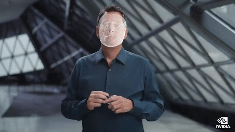

# 3DDFA filter

This document introduces the 3DDFA filter in FFmpeg GPU Demo. The 3DDFA filter is similar to the pose filter, as it also shows how to perform inference and rendering in FFmpeg. Instead of rendering a medical mask, the 3DDFA filter can reconstruct 3D face model from the input image. 3DDFA is also opensource on [GitHub](https://github.com/cleardusk/3DDFA_V2).

<p align="center">
  
</p>

## Compilation

The 3DDFA filter depends on the following libraries
* libtorch >= 1.9.1
* torchvision >= 0.11.1
* tensorrt >= 8.0
* EGL
* OpenGL
* Assimp
* libsdl2
* cnpy
* CUDA >= 11.0

As there are a lot of dependencies, we strongly recommend you to use the Dockerfile provided in the repo.
```bash
cd ffmpeg-gpu-demo
docker build -t ffmpeg-gpu-demo:22.03-py3 --build-arg TAG=22.03-py3 .
docker run --gpus all -it --rm -e NVIDIA_DRIVER_CAPABILITIES=all -v $(pwd):/workspace/ffmpeg-gpu-demo ffmpeg-gpu-demo:22.03-py3
```
We use the PyTorch image on [NGC containers](https://catalog.ngc.nvidia.com/orgs/nvidia/containers/pytorch) as base image, you can change `TAG` to other tags of the PyTorch image.

Once you are in the container, you can build the ffmpeg with the 3DDFA filter.
```bash
cd ffmpeg-gpu-demo/ffmpeg-gpu/
bash config_ffmpeg_libtorch.sh
make -j10
make install
```

## Run the filter

Before running the filter, we need to download the ONNX models of 3DDFA and convert them to TensorRT engines. There are three models to download: [FaceBox](https://drive.google.com/file/d/1pccQOvYqKh3iCEHc5tSWx2-1fhgxs6rh/view?usp=sharing), [MobileNet](https://drive.google.com/file/d/1pccQOvYqKh3iCEHc5tSWx2-1fhgxs6rh/view?usp=sharing) and [bfm](https://drive.google.com/file/d/1-w_u17Lq1Aykpjohz9X4xvBI6syaKByY/view?usp=sharing). Sample command to convert the onnx models to TRT engines:

```bash
polygraphy convert --fp16 --model-type onnx --input-shapes input:[1,3,720,1280] --workspace=8G -o 3ddfa/FaceBoxesProd_fp16.trt --convert-to trt FaceBoxesProd.onnx
polygraphy convert --fp16 --workspace 8G -o 3ddfa/trt/mb1_120x120_fp16.trt --convert-to trt mb1_120x120.onnx
polygraphy convert --fp16 --workspace 8G -o 3ddfa/trt/bfm_noneck_v3_fp16.trt --convert-to trt bfm_noneck_v3.onnx --input-shape alpha_shp:[40,1] alpha_exp:[10,1]
```

The size of the input image is determined by `input` of FaceBoxesProd.onnx, you can change it to fit your video resolutions. Please refer to the [CLI user guide](https://github.com/NVIDIA/TensorRT/tree/master/tools/Polygraphy/polygraphy/tools) of Polygraphy for more details. You can also use `trtexec` to perform the conversion.

After the converting the models, you can run the filter with:
```bash
ffmpeg -hwaccel cuda -hwaccel_output_format cuda -extra_hw_frames 5 -i input.mp4 -vf scale_npp=1280:720,3ddfa=./3ddfa -c:v hevc_nvenc -preset p7 output.mp4
```

3DDFA takes one argument which is the path containing the TRT engines and the vertices (`3ddfa/3dmm_verts.npy`) to draw. Please do not put the onnx models and trt engines in the same folder as it will confuse the file reader. The `-extra_hw_frames 5` is not required, if ffmpeg returns *no decoder surfaces left* error, then you need this option to allocate more HW frames.

The filter can also be used with other filters:
```
ffmpeg -i input.jpg -vf format=nv12,hwupload_cuda,3ddfa=./3ddfa,hwdownload,format=nv12 out.png
```
You can also run the filter with SR models like the pose filter.

Note that we only implemented the 3D feature of 3DDFA. As 3DDFA is a much lighter-weight model, the performance of 3DDFA filter should be quite faster when there is only one face in the video. We will release an improvement on this filter in the future which runs everything on GPU and unlocks higher performance.