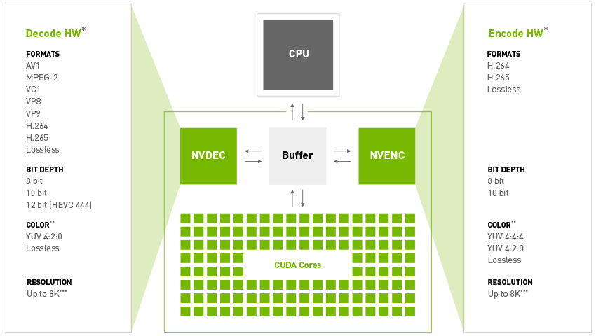

# FFmpeg GPU Acceleration

This document describes how to use NVIDA GPU hardware acceleration in FFmpeg. You can use GPU for both video codec (NVENC/NVDEC) and video processing (avfilter). Please note that our project only has __Linux support__ at this moment. You are welcome to explore it on other OS.

## Compile FFmpeg with NVIDIA GPU support

First, clone the repo and install nv-codec-headers.

```bash
git clone https://github.com/NVIDIA/FFmpeg-GPU-Demo.git
cd ffmpeg-gpu-demo/ffmpeg-gpu
git clone https://git.videolan.org/git/ffmpeg/nv-codec-headers.git
cd nv-codec-headers
make
sudo make install
```

FFmpeg loads CUDA Driver API using `dlopen()`, which is done in the nv-codec-headers. After installing the headers, you can configure FFmpeg with GPU codec support.

```bash
cd .. # Go back to ffmpeg directory
./configure --enable-nvenc
```

You can omit the `--enable-nvenc` option as well, as it is default if NVIDIA GPU drivers are detected and a supported GPU is installed. Check out NVIDIA's GPU [support matrix](https://developer.nvidia.com/video-encode-and-decode-gpu-support-matrix-new) for GPU codec support.

If you want to unlock the full GPU support in FFmpeg, you need to install CUDA Toolkit first. Please refer to [this page](https://developer.nvidia.com/cuda-downloads) for CUDA Toolkit download and installation. After installing CUDA Toolkit, configure FFmpeg with the following command.

```bash
./configure --enable-nonfree --enable-cuda-nvcc --enable-libnpp --extra-cflags=-I/usr/local/cuda/include --extra-ldflags=-L/usr/local/cuda/lib64 --disable-static --enable-shared
```

If you are developing under ffmpeg, it is recommended to add `--disable-stripping` when configuring ffmpeg, which makes the compilation much faster and the debug symbols unstripped when you run `make install`.

Then compile the code.
```bash
make -j8
sudo make install # optional
```

## NVENC/NVDEC hardware

NVIDIA GPUs contain one or more __hardware-based decoder and encoder(s) (separate from the CUDA cores)__ (see Fig 1). This means video decoding/encoding is offloaded to the dedicated hardware engines and does not occupy your CUDA cores. Refer to the [support matrix](https://developer.nvidia.com/video-encode-and-decode-gpu-support-matrix-new) for the NVDEC/NVENC numbers and supported formats of your GPU.

 |
|:--:|
| *Fig 1 GPU Hardware Video Engines* |

## Transcode using NVDEC/NVENC

### Decoding

There are two methods to decode videos using GPU in FFmpeg, CUDA hwaccel and CUVID decoder.

Sample command using CUDA:
```bash
ffmpeg -hwaccel cuda -i input output
```

Sample command using CUVID:
```bash
ffmpeg -c:v h264_cuvid -i input output
```

Obviously, CUVID assumes you to know the source codec before decoding, but CUDA does not. So it would be more convenient to use CUDA. This is also suggested by the community (see more about CUVID and CUDA [here](http://ffmpeg.org/pipermail/ffmpeg-devel/2018-November/235929.html)).

### Encoding

All GPU HW encoder is named as __[codec]\_nvenc__ in ffmpeg, for instance, h264_nvenc is the GPU H.264 encoder, hevc_nvenc is the H.265 encoder. You can check all nvenc encoders using this command:
```bash
ffmpeg -encoders | grep nvenc
```

nvenc is implemented using NVIDIA CODEC SDK. CODEC SDK provides a set of low-level API which contains various of encoding settings and parameters. FFmpeg exposed some of the encoding settings, you can check them by:
```bash
ffmpeg -h -encoder=h264_nvenc
```

### Transcoding

Combining decoding and encoding together, you can transcode a video using
```bash
ffmpeg -y -vsync 0 -hwaccel cuda -i input.mp4 -c:a copy -c:v h264_nvenc -b:v 5M output.mp4
```

As we have mentioned, GPU decoders are hardware-based, when decoding a video stream, the decoded image will be stored in the GPU memory. By default, ffmpeg will copy the decoded frames back to CPU memory, so that you can use the CPU filters.

To avoid the host-device copy and use GPU filters in ffmpeg, add `-hwaccel_output_format cuda` to the command.

```bash
ffmpeg -y -vsync 0 -hwaccel cuda -hwaccel_output_format cuda -i input.mp4 -vf scale_cuda=1280:720 -c:a copy -c:v h264_nvenc -b:v 5M output.mp4
```

The above command scales the input to 1280x720. You can also resize/crop the video using GPU decoder (-crop (top)x(bottom)x(left)x(right)).

```bash
ffmpeg -hwaccel cuda -hwaccel_output_format cuda –resize 1280x720 -i input.mp4 -c:a copy -c:v h264_nvenc -b:v 5M output.mp4
ffmpeg -y -vsync 0 -hwaccel cuda -hwaccel_output_format cuda –crop 16x16x32x32 -i input.mp4 -c:a copy -c:v h264_nvenc -b:v 5M output.mp4
```

There are 5 GPU filters provided by ffmpeg: scale_cuda, scale_npp, overlay_cuda, yadif_cuda, thumbnail_cuda. We will continue to develop more GPU filters in FFmpeg GPU Demo. Other GPU filters provided by FFmpeg GPU CUDA will be documented independently.

## Reference Links
https://docs.nvidia.com/video-technologies/video-codec-sdk/ffmpeg-with-nvidia-gpu/
https://trac.ffmpeg.org/wiki/HWAccelIntro