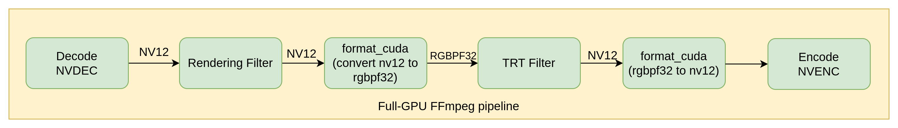

# TensorRT Filter

This document introduces how to use the TensorRT filter in this project as well as the design of the filter.

## Compilation

To enable the TensorRT filter, you need to install TensorRT first. Please refer to the TensorRT [installation guide](https://docs.nvidia.com/deeplearning/tensorrt/install-guide/index.html) or use the [container image](https://catalog.ngc.nvidia.com/orgs/nvidia/containers/tensorrt) provided by NGC.

You need to enable cuda-nvcc and add `--enable-libtensorrt` when configuring ffmpeg.
```bash
./configure --enable-nonfree --enable-libtensorrt --enable-cuda-nvcc --extra-cflags=-I/usr/local/cuda/include --extra-ldflags=-L/usr/local/cuda/lib64 --disable-static --enable-shared --nvccflags="-gencode arch=compute_86,code=sm_86"
```
The nvccflags option is set as CUDA kernels are used. It is recommended to always set nvccflags if CUDA kernels are involved, as ffmpeg's default nvccflags are out of date.

FFmpeg will check TensorRT installation, if configuration failed, errors will be saved in ffmpeg-gpu/ffbuild/config.log. If successful, `CONFIG_TENSORRT_FILTER` should be set to 1 in `config.h`.

Compile the code and you should be able to see the TensorRT filter.
```bash
make -j8
ffmpeg -filters | grep tensorrt
```

## Usage
Below is sample command of the TensorRT filter
```bash
ffmpeg -hwaccel cuda -hwaccel_output_format cuda -i <input file> -vf scale_npp=1280:720,format_cuda=rgbpf32le,tensorrt=<model path>,format_cuda=nv12 -c:v h264_nvenc <output file>
```
The scale_npp filter is only a demonstration showing the TensorRT filter can be used along with existing ffmpeg GPU filters. The pipeline is described as Fig 1.

 |
|:--:|
| *Fig 1 TensorRT Filter Pipeline* |

Our target secnario of the TensorRT filter is video enhancement, e.g. super-resolution. Currently, the TensorRT filter only support models whose __input and output are both images__. There should be only __one input__ and __one output__ respectively.

The TensorRT filter accepts TensorRT engines or ONNX models. It is recommended to use [trtexec](https://github.com/NVIDIA/TensorRT/tree/main/samples/trtexec) or [polygraphy](https://github.com/NVIDIA/TensorRT/tree/main/tools/Polygraphy) to convert your ONNX model to TensorRT engine, as they are quite powerful tools.

You might have noticed that there is also a `format_cuda` filter in the command. TensorRT requires NCHW data layout, which is planar RGB data (normal packed RGB data is NHWC), and our decoded frames are usually in NV12 format.

We added a new pixel format called __RGBPF32__, which means FP32 planar RGB. The format_cuda filter is responsible for converting between RGBPF32 and NV12. The conversion is done by CUDA kernels.

## Filter implementation

Please see the following files for the implementation:

- libavfilter/vf_tensorrt.c
- libavfilter/tensorrt.*
- libavfilter/vf_format_cuda.c
- libavfilter/format_cuda.h
- libavfilter/format_cuda.cu